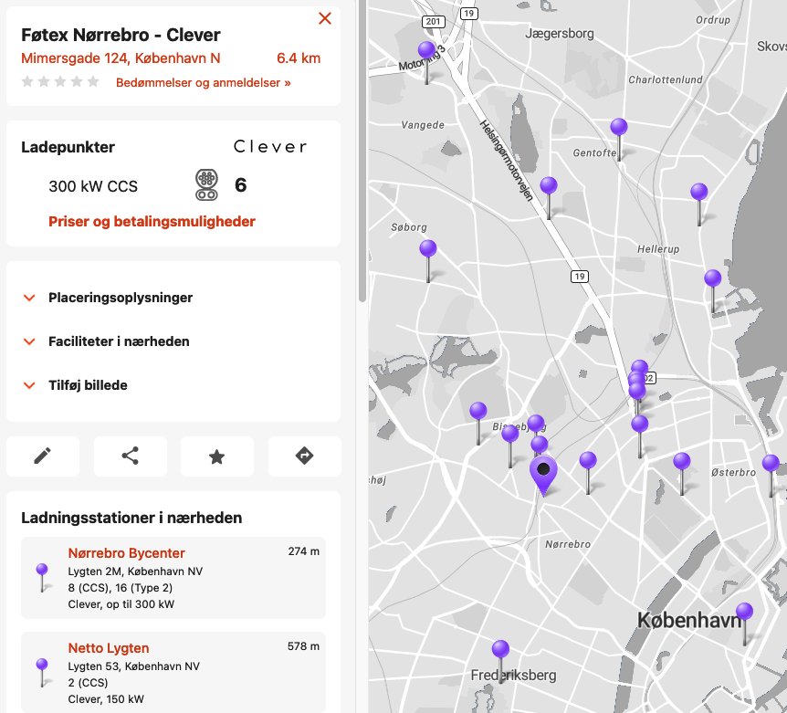
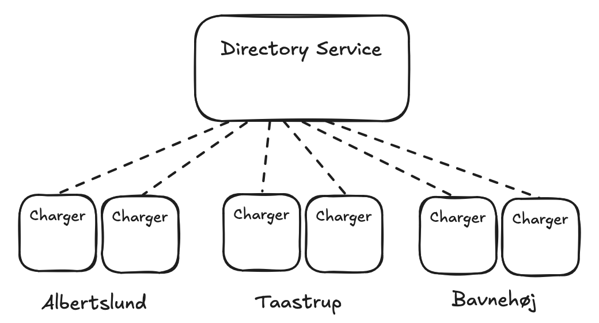
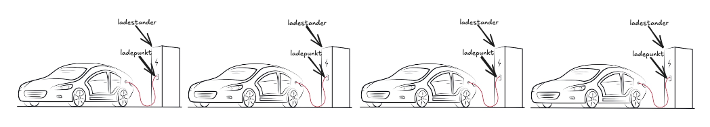
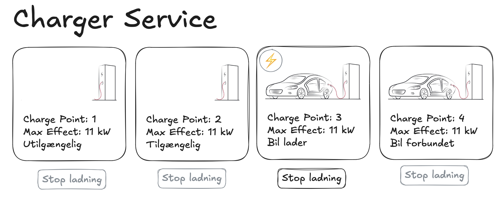

# Aflevering 2: Front-end og Deployment

Aflevering 2 handler om to ting:
- at bygge en JavaScript front-end til vores ladestander-service,
- at deploye mere end én ladestander-service i samme Docker Compose-konfiguration.

## Formalia til aflevering

Afleveringen stilles som en GitHub Classroom-opgave, man skal acceptere og klone ned på sin egen computer.

Opgaven afleveres ved at man committer og pusher til GitHub Classroom inden fristen:

**Lørdag den 28. september kl. 18:00.**

Regler for samarbejde:
- Opgaven er individuel.
- Man må gerne sidde sammen og løse den
- Man må gerne hjælpe hinanden
- Copy-paste er ikke tilladt
- Man må bruge LLM'er, men læser man [Jošt, Taneski og Karakatič (2024)](https://www.mdpi.com/2076-3417/14/10/4115), lærer man at deres undersøgelse fandt en signifikant negativ sammenhæng mellem øget gennemsnitlig LLM-brug og lavere slutkarakterer for studerende, hvilket tyder på, at _afhængighed af LLM'er kan hindre udviklingen af grundlæggende problemløsningsevner_. Hver gang I copy-paster mellem en LLM og en IDE, uddanner I jer til sekretærer.

## Problemdomæne: Ladestandere til elbiler

I opgaven arbejder vi fortsat for en ladeoperatør.

Hver ladestander på netværket kører en enkelt Charger Service (kodet i Java).

En Charger Service vedligeholder derfor tilstanden for en enkelt ladestander, ikke flere.

Hvis vi vil repræsentere flere Charger Services, skal vi derfor køre flere Docker-containere i gruppe. 

Charger Service er ikke først og fremmest en hjemmeside man besøger som privatperson, men et API (application programming interface) der kører på et internt netværk, som mest bliver besøgt af andre services. Det skal dog kunne lade sig gøre for ladeoperatører at besøge servicen via web. Indtil nu er det sket via JSON, men vi vil gerne lave en almindelig hjemmeside, som benytter API'et via JavaScript.

I billedet nedenfor (ChargeFinder.com) svarer en udvalgt nål på billedet til en samling af 6 af Clever's ladere på Mimersgade, som hver har 300 kW og benytter stiktypen CCS, hvilket de har tegnet pænt med et ikon. De viser også priser og betalingsmuligheder og meget andet. Vores service behøver ikke at vise alt det.



## Domænemodel

Efter at have arbejdet med ladenetværk i noget tid, har vi lært følgende om domænet vi arbejder i:

- `Charger`: Repræsenterer en enkelt ladestanders tilstand.
  - Nogle ladestandere kan lade flere biler tilkoblet samtidigt.
  - Ledninger der stikker ud af ladestanderen hedder ladekabler.
  - Alt logik der hører til at foretage en ladning på et kabel kaldes et ladepunkt.
  - Der er et ladekabel for hvert ladepunkt, så man kan tælle ladepunkter ved at tælle kabler.
  - Ladestanderens samlede tilstand er samlingen af tilstande for hvert ladepunkt.
  - Hvis et enkelt ladepunkt er utilgængeligt (fx i brug, ukendt eller fejl), men et andet ladepunkt er tilgængeligt, er laderen delvist tilgængelig.
- `ChargePoint`: Et ladepunkt. Hvert `ChargePoint` har:
  - et *charge point ID* (et tal i intervallet 1-255).
  - et `ChargePointStatus` som indikerer ladepunktets tilgængelighed.
  - et *max Kilowatt* som ladepunktet kan aflade med (fx 22 kW eller 150 kW).

- `ChargePointStatus`: Tilgængeligheden for et enkelt ladepunkt.
  - `StateA`: Et ladepunkt er ledigt.
  - `StateB`: En bil er tilsluttet ladepunktet.
  - `StateC`: En bil er i gang med at lade.
  - `StateF`: Der er fejl på ladepunktet.
  - `StateU`: Ladepunktets tilstand er _ukendt_, vi tror det er _utilgængeligt_.


## Service-Orienteret Arkitektur

Vores service-orienterede arkitektur er ikke vokset:

- Directory Service: En telefonbog, så services kan finde hinanden
- Charger Service: En ladestander



## Brug af Docker og Docker Compose

Du kan få brug for tre Docker Compose-kommandoer:

```
# Bygger (eller genbygger) begge services:
docker compose build

# Starter alle services i baggrunden:
docker compose up -d

# Stopper begge services:
docker compose down
```

I aflevering 1 kunne du arbejde med Charger Service's back-end fra IntelliJ uden at køre Directory Service. 

I aflevering 2 kan du arbejde med Charger Service's front-end fra VSCode ved at køre back-end'en i Docker Compose.

Front-end-koden bliver serveret af Charger Service's back-end via en *Docker volume* som hægter en mappe udenfor Docker, som du kan arbejde i, til en mappe inde i Docker. Det er derfor muligt at opdatere front-end-koden uden at genstarte Docker-containerne.

## Delopgave 1: Lav flere Charger Services i `compose.yaml`

Det er blevet tid til Docker Compose!

Én Charger Service repræsenterer en enkelt ladestander.

Hvis man har flere ladestandere, skal man derfor køre flere Charger Services.

Det simulerer vi ved at køre flere Docker-containere, som er koblet sammen ved hjælp af en `compose.yaml`-fil.

Det gør vi fordi det skal være muligt for ladestanderens hardware at kontakte Charger Service også selvom den er uden netforbindelse. (Husk, Charger Service kører inde i ladestanderen, ikke hos One.com.) Hvis vi havde én stor app i skyen, som håndterede tilstanden for alle ladere i netværket, og den bliver utilgængelig, eller hvis en enkelt ladestander mister sin netforbindelse, kan man ikke foretage ladning. Vi ønsker ikke at én central service skal kunne invalidere tusindvis af ladestandere, og vi ønsker heller ikke at en manglende netforbindelse på en enkelt ladestander skal umuliggøre ladning.

Det er tanken bag en [distribueret arkitektur](https://estuary.dev/distributed-architecture/): Der må ikke være et "single point of failure".



Trin for at løse opgaven:

- I filen `compose.yaml`: Copy-paste sektionen for `charger-1` og lav to magen til der hedder `charger-2` og `charger-3`. **Pas på du ikke laver whitespace-fejl!** YAML-formatet er meget whitespace-sensitivt og tåler ikke at man sjusker.
- Gør så hver kopi af `charger-1` binder til forskellige porte, fx: `8081:8080`, `8082:8080`, `8083:8080`.

Når der fx står `8081:8080` skal det forstås som `HOST_PORT:CONTAINER_PORT`: Hver eneste instans af Spring Boot-applikationen lytter på port 8080, men inde i hver sin container på hver sin container-specifikke IP-adresse. Derfor behøver de ikke slås om hvem der får port 8080, for det gør de alle sammen. "Host" betyder din computer uden for Docker. Uden for Docker bliver de mappet til forskellige porte.

## Delopgave 2: Konfiguration med miljøvariable

Det er blevet tid til Java _og_ Docker Compose!

Når man pakker en applikation ind i en Docker-container, er det for at gøre det nemmere for andre at køre applikationen uden at de har en dyb forståelse for hvordan den er lavet. Derfor kan det godt blive lidt sværere at arbejde med, fordi man skal 

Til det formål bruger man *miljøvariable* (eng. *environment variables*) til at styre applikationens indstillinger. For eksempel behøver man ikke vide hvordan en MySQL-database er kodet, man behøver bare sætte et brugernavn og et kodeord for databasen, så man kan logge ind.

Trin for at løse opgaven:

- I `compose.yaml` skal du sætte tre variablen for hver `charger`:
  - `NUM_CHARGE_POINTS` skal sættes til et positivt heltal
  - `MAX_EFFEKT_KILOWATT` skal også sættes til et positivt heltal
  - `CHARGER_NAME` skal sættes til fx `charger-1` for den service
- I `Charger.java` skal du i stedet for `var numChargePoints = 2;` læse tallet fra en miljøvariabel.
- I `Charger.java` skal du i stedet for `var maxEffectKilowatt = 11;` læse tallet fra en miljøvariabel.
- I `RegisterRequest.java` skal du i stedet for `var uniqueName = "charger-1"` læse navnet fra en miljøvariabel.

Det kan være nødvendigt løbende at skrive `docker compose down` og `docker compose up -d` for at afprøve.

## Delopgave 3: En front-end til Charger Service

Det er blevet JavaScript tid!

Start Charger Service, enten med `docker compose up -d` eller inde i IntelliJ:

- Hvis du vælger Docker Compose, er adressen for `charger-1` på: http://127.0.0.1:8081/
- Hvis du vælger IntelliJ, er adressen for `charger-1` på: http://127.0.0.1:8080/

Koden til front-end ligger i mappen `charger-service/frontend/` 

Trin for at løse opgaven:

- Brug CSS og ES5 / jQuery til at tegne en kasse for hver ladestander som back-end'en svarer med.
- Lav et script med jQuery der sender en `GET /charger` hvert 10. sekund og opdaterer overblikket.
- Lav en knap for hvert ladepunkt hvor der står "Stop ladning" der sender en `POST /charger/stop` med parameteren `charge_point_id` sat. Gør knappen `disabled` hvis ladestanderen ikke har tilstanden `StateC`. (Man kan ikke stoppe en ladning der ikke er i gang.)



(Kreativ fortolkning, den faktisk front-end's design er op til dig.)